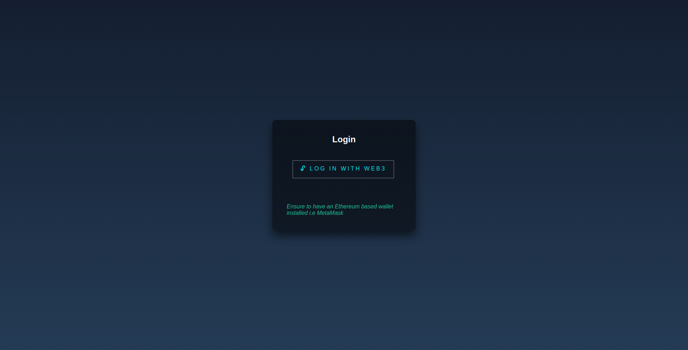
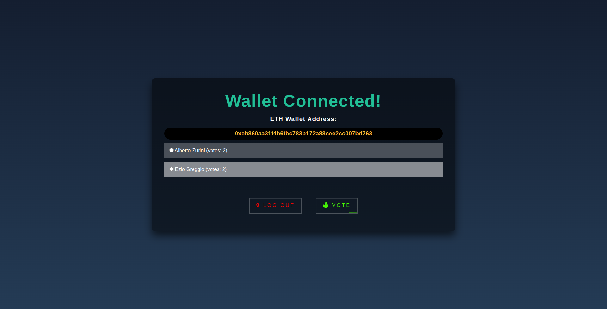

# Decentralised Voting System

### Some Background
We're currently participating in [Junction Hackathon 2022](https://www.junction2022.com/), in the [Year 2222](https://www.junction2022.com/challenges/) challenge and in the [Society 2.0](https://www.junction2022.com/challenges/) challenge. 
During this hackathon we created this solution and we're excited to be able to share it with you all.

## Project Setup
### Prerequisites
- [Node.js](https://nodejs.org/en/)
- [Yarn](https://classic.yarnpkg.com/en/docs/install/#windows-stable)
- [Ganache](https://www.trufflesuite.com/ganache)
- [Metamask](https://metamask.io/)
- [Truffle](https://www.trufflesuite.com/truffle)
- [IPFS](https://ipfs.io/)*
- [Solidity](https://docs.soliditylang.org/en/v0.8.10/installing-solidity.html)
- [Web3.js](https://web3js.readthedocs.io/en/v1.5.2/)

_*: not mandadory_

### Installation
1. Clone the repo
   ```sh
   git clone https://github.com/mrBymax/junction2022.git
   ```
2. Install NPM packages
   ```sh
    yarn install
    ```
   or
   ```sh
    npm install
    ```
3. Start Ganache trough GUI/CLI
4. Compile and migrate the smart contracts
   ```sh
   truffle migrate
   ```
5. Start the client
   ```sh
    yarn start
    ```
   or
   ```sh
    npm start
    ```
6. Run the tests
   ```sh
   truffle test
   ```
7. Deploy the smart contracts to the blockchain
   ```sh
    truffle migrate --network <network>
    ```
    where `<network>` is one of the networks specified in `truffle-config.js`.
8. Build the application for production
   ```sh
    yarn build
    ```
   or
   ```sh
    npm run build
    ```
9. Run the application in production mode
10. Deploy the application to IPFS (not mandadory)
    ```sh
    ipfs add -r build
    ```
    
## Usage
### Login


### Taking part in a Poll
1. Connect your Metamask wallet to the application
2. Click on `VOTE` button to express your preference




### Add Candidates
For now, only governors can add candidates to a poll. To do so, you need to edit the `addCandidate` function in `src/contracts/Election.sol` and then deploy the contract again.

